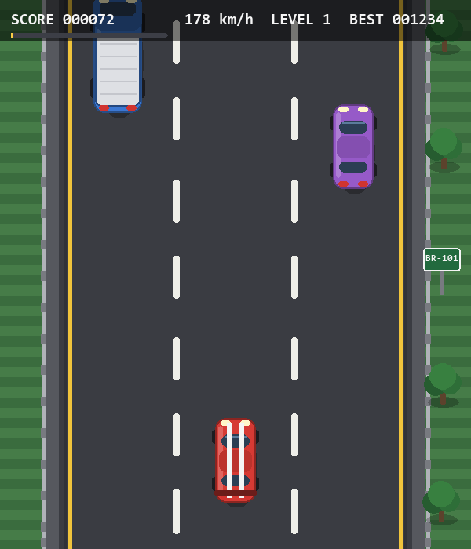

# Traffic Escape

A 2D highway dodging game written with Python and Pygame. You drive the red car
at the bottom of a three-lane road, switch lanes and avoid the slower traffic
ahead. The road markings, guardrails, trees and signs scroll downwards, so it
looks like you are the one overtaking everybody.



## Running

```bash
python -m venv .venv
./.venv/Scripts/python.exe -m pip install -r requirements.txt
./.venv/Scripts/python.exe main.py
```

On Linux or macOS use `.venv/bin/python` instead.

## Controls

| Key | Action |
| --- | --- |
| LEFT / RIGHT or A / D | change lane |
| SPACE / ENTER | start the race |
| P | pause and resume |
| R | race again after a crash |
| ESC | quit |

## How it works

- The player car only moves between the three lane centres defined in
  `config.LANE_CENTERS`, gliding towards the target lane and tilting while it
  moves.
- Traffic cars fall down the screen at `road_speed - own_speed`, so the heavy
  trucks and buses are overtaken quickly and the fast cars stay close for
  longer. When a car leaves the bottom of the screen it returns to the top in a
  random lane, and the spawner never blocks all three lanes at the same height.
- Collisions are detected with `Rect.colliderect` on slightly shrunk hitboxes.
  A crash plays a frame-by-frame explosion animation, and only when the last
  frame is reached does the game over screen appear.
- Every sprite, the explosion frames and the sound effects are generated at
  runtime, so the repository ships no binary assets.
- Score, level, speed and the persisted best run are shown in the HUD; the road
  keeps accelerating and more traffic joins as the level goes up.
